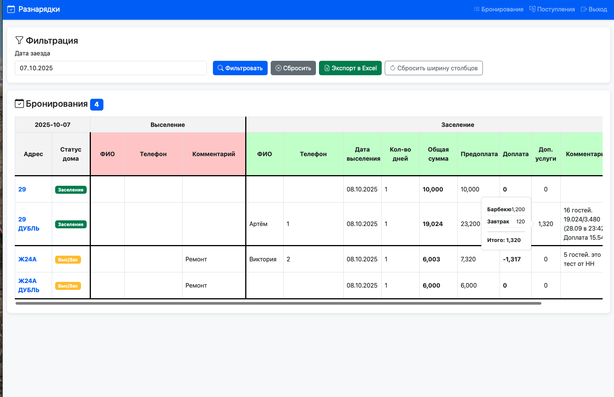

#   Разнарядки для посуточников

FastAPI сервис для отображения бронированиями недвижимости с интеграцией через webhook и веб-интерфейсом для просмотра и экспорта данных.


## Возможности

- 📥 **Webhook Integration** - прием данных о бронированиях через webhook (create, update, delete)
- 💾 **PostgreSQL Database** - хранение всех данных о бронированиях
- 🖥️ **Web Interface** - просмотр бронирований в удобной таблице
- 🔍 **Фильтрация** - по дате заезда
- 📊 **Экспорт в Excel** - выгрузка данных с форматированием
- 💰 **Управление расходами** - учет расходов по объектам и общих расходов
- 🔐 **Аутентификация** - простая авторизация через логин/пароль
- 📝 **Логирование** - детальное логирование через loguru
- **Доступные интеграции** 
  - Realty Calendar (webhook)
  - Traveline (в разработке)


## Требования

- Python 3.12+
- PostgreSQL 12+

## Установка

### 1. Клонирование репозитория

```bash
git clone https://github.com/darkClaw921/raznaradki_realty_calendar
cd raznaradki_realty_calendar
```

### 2. Установка зависимостей

```bash
uv sync
```

### 4. Настройка переменных окружения

Скопируйте пример файла и отредактируйте его:

```bash
cp .env.example .env
```

Отредактируйте `.env`:


## Запуск

### Быстрый старт с Docker (В разработке)

```bash
# Запуск всех сервисов (PostgreSQL + FastAPI)
docker-compose up -d

# Просмотр логов
docker-compose logs -f app

# Остановка
docker-compose down
```

Приложение будет доступно на `http://localhost:port`

### Локальный запуск

#### Режим разработки

```bash
# Используя скрипт запуска
./run.sh

# Или напрямую
uv run raznaradki_main.py
```

#### Производственный режим

```bash
uvicorn app.main:app --host 0.0.0.0 --port 8000 --workers 4
```


## Интеграция с Realty Calendar

Для интеграции с Realty Calendar, вам необходимо настроить webhook на сервере Realty Calendar.
для этого вам необходимо в Realty Calendar в разделе "Настройки" -> "Webhooks" -> "Добавить webhook" и ввести URL вашего сервера и нажать "Сохранить".
URL вашего сервера будет выглядеть так: `http://localhost:port/webhook`


## Миграция БД (для существующих установок)

Если у вас уже установлена предыдущая версия, выполните миграции:

### Миграция индексов

```bash
uv run python add_indexes_migration.py
```

Эта миграция добавит индексы на поля `apartment_title` и `is_delete` для ускорения запросов. Время обработки запросов уменьшится с ~5 секунд до < 1 секунды.

### Миграция таблицы расходов

```bash
uv run python migrate/create_expenses_table.py
```

Эта миграция создаст таблицу `expenses` для учета расходов.

## Использование

### Веб-интерфейс

1. Откройте браузер и перейдите на `http://localhost:port`
2. Войдите с учетными данными из `.env` файла (по умолчанию `admin`/`admin`)
3. На странице бронирований:
   - Просматривайте все бронирования
   - Фильтруйте по дате заезда
   - Экспортируйте данные в Excel

### Webhook API

Отправьте POST запрос на `/webhook` с данными бронирования:

```bash
curl -X POST http://localhost:port/webhook \
  -H "Content-Type: application/json" \
  -d @create_booking.json
```

Формат данных смотрите в примерах: `create_booking.json`, `update_booking.json`, `delete_booking.json`

#### Тестирование webhook

Используйте тестовый скрипт:

```bash
./test_webhook.sh
```

### API Documentation

Интерактивная документация доступна по адресам:
- Swagger UI: `http://localhost:port/docs`
- ReDoc: `http://localhost:port/redoc`

## Структура таблицы бронирований

Таблица имеет два уровня заголовков:

**Уровень 1:**
- Основная информация
- Выселение
- Заселение  
- Финансовые данные

**Уровень 2:**
- ID, Адрес, Статус дома
- ФИО, Телефон, Время выселения, Дата выселения
- ФИО, Телефон, Время заселения, Дата заселения
- Кол-во дней, Общая сумма, Предоплата, Доплата

## Endpoints

### Webhook
- `POST /webhook` - прием данных о бронированиях

### Web UI
- `GET /` - главная страница (редирект на /bookings)
- `GET /login` - страница входа
- `POST /login` - обработка входа
- `GET /logout` - выход
- `GET /bookings` - список бронирований (с фильтром)
- `GET /expenses` - список расходов (с фильтром)
- `GET /export` - экспорт в Excel

### Служебные
- `GET /health` - проверка работоспособности

## Разработка

### Структура проекта

```
app/
├── main.py              # Главное приложение FastAPI
├── config.py            # Конфигурация
├── database.py          # Подключение к БД
├── models.py            # SQLAlchemy модели
├── schemas.py           # Pydantic схемы
├── crud.py              # CRUD операции
├── auth.py              # Аутентификация
├── routers/
│   ├── webhook.py       # Webhook endpoints
│   ├── web.py           # Web UI endpoints
│   └── expenses.py      # Expenses endpoints
├── static/js/
│   └── expenses.js      # JavaScript для расходов
└── templates/           # HTML шаблоны
    └── expenses.html    # Шаблон страницы расходов
```

Подробное описание архитектуры в файле `architecture.md`

### Логирование

Логи записываются в:
- Консоль (цветной вывод)
- Файл `logs/app.log` (ротация 10MB, хранение 30 дней)

## Безопасность

⚠️ **Важно для production:**
- Измените `ADMIN_PASSWORD` в `.env`
- Используйте сложный `SECRET_KEY`
- Настройте HTTPS

- Регулярно обновляйте зависимости

## Лицензия

MIT

## Поддержка

По вопросам обращайтесь к разработчикам проекта.

